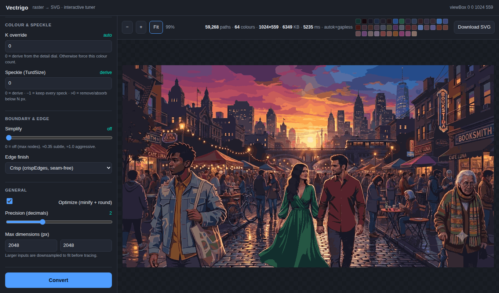

# Vectrigo web app

An interactive browser front-end for the vectrigo engine: upload a raster,
tune every conversion lever, and inspect the resulting SVG with zoom, pan, and
click-to-outline — a convenient way to dial a conversion in to your liking.



## Run

From the repository root:

```sh
go run ./examples/webapp
```

Then open <http://localhost:8080>. Use `-addr` to change the port:

```sh
go run ./examples/webapp -addr :9000
```

It is pure Go with no external assets — the single HTML page is embedded in the
binary via `go:embed`, so `go build ./examples/webapp` produces a
self-contained server.

## What it does

1. **Upload** a PNG / JPEG / WEBP (drag-and-drop or click).
2. **Pick a pipeline** and tune its levers. Only the levers relevant to the
   current choice are shown (see the matrix below).
3. **Convert** — the image is sent to `POST /convert`, traced by the engine,
   and returned as SVG plus stats.
4. **Inspect** — the SVG is shown inline; scroll to zoom, drag to pan, and
   **click any area to outline that shape** (its fill colour and index appear
   in the corner).
5. **Read the stats** — path count, distinct-colour count, dimensions, byte
   size, conversion time, and the resolved pipeline, with a swatch strip of the
   palette.
6. **Download** the SVG.

## Presets

The dropdown above the levers applies a tuned starting point; touching any
lever afterwards switches back to **Custom** so you always know whether you're
on a preset or your own mix.

| Preset | Configuration | Best for |
| --- | --- | --- |
| Logo / flat graphics | Auto-K, mask tracing | flat art: natural colour count, smooth Bézier curves |
| Illustration | Sensitivity 60 + Gapless + subtle simplify | posters / cartoons: posterized colours, contiguous shapes |
| Photo | Photo mode defaults (σ_r 12, crisp) | photographic content, balanced |
| Photo — high detail | Auto-K + Gapless + subtle simplify | sharpest faces and small text; larger files |
| Photo — compact | Photo mode + aggressive simplify | smallest files, coarser shapes |
| Maximum fidelity | Auto-K + Gapless, speckle −1, no simplify | archival trace: every speck kept, biggest files |

## Levers and when they apply

The three pipelines are mutually exclusive; **Gapless** is a modifier on the two
quantization pipelines. The UI hides every lever that has no effect on the
current selection:

| Lever | Sensitivity | Auto-K | Photo | + Gapless |
| --- | :---: | :---: | :---: | :---: |
| Sensitivity | ✓ | | | (with Sensitivity) |
| Auto-K τ (knee) | | ✓ | | (with Auto-K) |
| Photo detail σ_r | | | ✓ | |
| K override | ✓ | ✓ | | ✓ |
| Speckle (TurdSize) | ✓ | ✓ | | ✓ |
| Gapless | ✓ | ✓ | | — |
| Simplify | | | ✓ | ✓ |
| Edge finish | | | ✓ | ✓ |
| AlphaMax (curves) | ✓ | ✓ | ✓ | — (polylines) |
| Optimize, Precision, Max dimensions | ✓ | ✓ | ✓ | ✓ |

`AlphaMax` controls Bézier corner smoothing and so applies only where the tracer
fits curves (the mask quantizer and photo mode); the gapless and photo
region tracers emit smoothed polylines, tuned by **Simplify** and **Edge finish**
instead.

## API

`POST /convert` takes a `multipart/form-data` body with an `image` file and the
lever fields, and returns JSON:

```json
{
  "svg": "<svg …>…</svg>",
  "paths": 59268,
  "colors": 64,
  "palette": ["#0a0c10", "#…"],
  "width": 1024, "height": 559, "viewBox": "0 0 1024 559",
  "bytes": 6501032, "millis": 4912,
  "pipeline": "autok+gapless"
}
```

This maps directly onto [`vectrigo.Config`](../../config.go); see the root
[README](../../README.md) for the meaning of each field.
